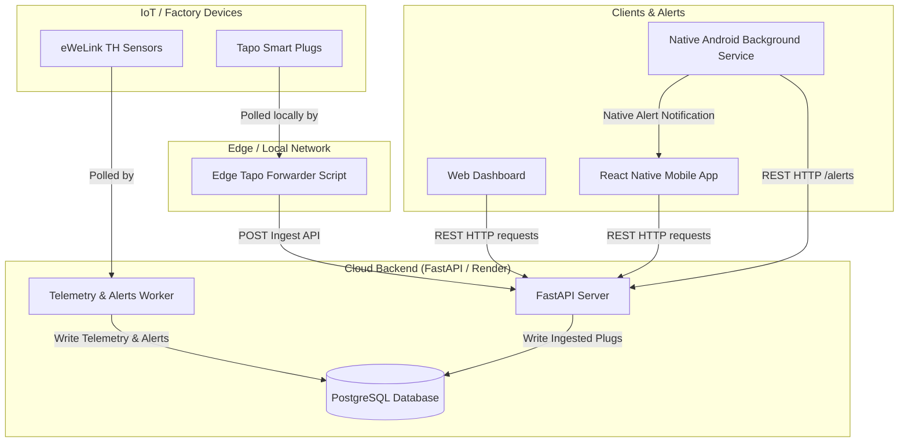
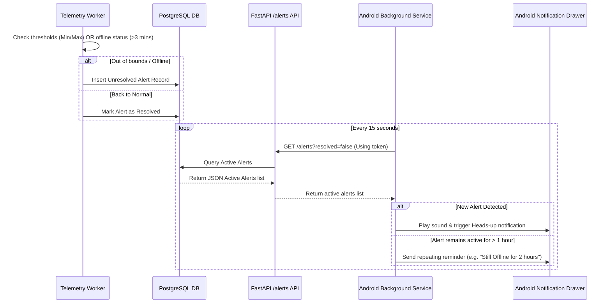

# Ground Up Monitoring System — Architecture & Data Flows

This document details the system design, code paths, and data flows of the Ground Up cold storage and facility monitoring platform. It is designed to help new developers understand how IoT devices, background workers, databases, mobile alerts, and web panels communicate.

---

## 🗺️ High-Level System Architecture



---

## 🔌 1. IoT Telemetry Ingestion Flow

We track two categories of IoT telemetry: temperature/humidity sensors and smart power plugs.

### A. Temperature & Humidity Sensors (eWeLink)
1.  **Polling Loop**: The backend worker (`backend/worker.py`) executes an `ingestion_loop` every 60 seconds.
2.  **Live API Query**: If eWeLink credentials are provided, it initializes `EwelinkClient` (`backend/services/ewelink.py`) to fetch data from the official eWeLink cloud API.
3.  **Simulation Fallback**: If credentials are missing, the worker automatically runs in simulator mode to generate realistic temperature/humidity values.
4.  **Database Write**: The worker inserts telemetry into the `monitoring.device_telemetry` table and writes raw values directly to the logical `monitoring.sensors` and `monitoring.sensor_readings` tables.

### B. Smart Power Plugs (Tapo P110)
1.  **LAN Limitation**: Tapo plugs can only be queried via local network LAN IP and credentials. They cannot be reached directly from a cloud server (like Render).
2.  **Edge Agent Solution**: A Python edge script running on the facility's local network (`edge_agent/edge_tapo_forwarder.py`) fetches tapo telemetry directly from the plugs' IP addresses on the local network.
3.  **Cloud Sync**: Every 60 seconds, this agent posts the collected data to the backend's `/sensors/device/{device_id}/plug/ingest` HTTP API.
4.  **Dashboard Display**: The web/mobile dashboard requests plug status from `/sensors/device/{device_id}/plug`. If Render cannot query the plug directly, it falls back to serving the **last known** database entry logged by the Edge Agent.

---

## 🚨 2. Alerting & Push Notification Flow

Alerting ensures temperature anomalies and offline sensors are detected and resolved immediately.



### A. Native Android Background Polling Service
*   **Sticky Mode**: The service (`BackgroundPollingService.java`) runs directly inside the Android operating system. Returning `START_STICKY` ensures that if the app is swiped away or closed, the OS automatically restarts it.
*   **Foreground Mode**: Promoted as a foreground service with a low-importance persistent notification, preventing the Android OS from killing the service for resource recovery.
*   **Shared Sandbox Credentials**: When the user logs in via the React Native app, `api.js` saves the auth JWT to `auth_token.txt` and the base URL to `api_url.txt` inside the app sandbox (`files/`). The native Java service reads these files to perform authenticated GET requests.
*   **Hourly Reminders**: If an alert remains active and unresolved, the service escalates the notification and re-alerts the user every **1 hour**, updating the header text to show how many hours the alert has been active (e.g., *"Still Offline: 2 hours"*).

---

## 🖥️ 3. Client State & Offline Display Handling

### A. 3-Minute Offline Threshold
The server marks a device as offline if it has not reported telemetry in the last **3 minutes** (which covers up to 3 skipped ingestion loops):
```python
is_online = (datetime.utcnow() - latest.timestamp) < timedelta(minutes=3)
```

### B. Offline Value Display (`--`)
When a sensor is marked offline (`is_online = false`):
1.  **Web Dashboard**: [web/index.html](file:///d:/Ground%20Up/ground-up-monitoring/web/index.html) checks the `is_online` property. If false, it updates the list cards, detail metrics, and facility map pins to display **`--`** instead of stale historical temperature values.
2.  **Mobile App**:
    *   **List View**: [SensorListScreen.js](file:///d:/Ground%20Up/ground-up-monitoring/mobile-shared/src/screens/SensorListScreen.js) displays `--` and the yellow `⚠️ OFFLINE` badge.
    *   **Detail View**: [DashboardScreen.js](file:///d:/Ground%20Up/ground-up-monitoring/mobile-shared/src/screens/DashboardScreen.js) clears the live temperature and humidity metrics to `--`.
    *   **Facility Map**: [FloorPlanScreen.js](file:///d:/Ground%20Up/ground-up-monitoring/mobile-shared/src/screens/FloorPlanScreen.js) updates coordinates markers to show `--` inside a grayed-out badge.

---

## 🔋 4. Render Keep-Alive Bot
*   **Problem**: Render's free tier spins down (sleeps) containers after 15 minutes of HTTP inactivity.
*   **Solution**: A GitHub Actions workflow ([keep_alive.yml](file:///d:/Ground%20Up/ground-up-monitoring/.github/workflows/keep_alive.yml)) runs a cron schedule every 10 minutes on GitHub's cloud. 
*   **Action**: It sends a `GET` ping request to `https://gumonitoring.onrender.com/health` to keep the container continuously awake 24/7.
